# Student Environment

::: info
This page contains instructions for setting up your development environment for this course. While
there's a lot information here, it **shouldn't take more than about 30 minutes to complete**
(depending on your internet connection). If you have any issues, please reach out to the course
staff for help.
:::

## What are Docker/Dev Containers?

Docker is a tool that allows you to easily run software in an isolated, reproducible environment in
the form of a container. Dev containers build on top of Docker containers, integrating with code
editors like Visual Studio Code to provide a seamless development experience. We will use Docker dev
containers in this course to provide a consistent baseline environment for students and instructors
alike, with all the necessary tools and libraries pre-installed!

## Setup Instructions

### Install Docker

::: tip
If you already have Docker installed and verified it is working (`docker run hello-world`), you can
skip this step.
:::

First, you will need to install Docker on your computer. Follow the instructions for your operating
system below:

- **Windows**: [Docker Desktop for Windows](https://docs.docker.com/docker-for-windows/install/)
  - We recommend using the WSL 2 backend for Docker Desktop on Windows.
- **Mac**: [Docker Desktop for Mac](https://docs.docker.com/docker-for-mac/install/)
- **Linux**: [Docker Engine for Linux](https://docs.docker.com/engine/install/)
  - We strongly **do not recommend** using the Docker snap package nor the Docker Desktop
    application on Linux.
  - Make sure to also complete the [post-installation steps for Linux](https://docs.docker.com/engine/install/linux-postinstall/).

::: warning
If you are running Docker Engine on Linux, because the [Docker daemon runs as root by default](https://docs.docker.com/engine/security/rootless/),
you can cause damage to your system if you run commands in the dev container as root (i.e.: with
`sudo`) carelessly. As always, practice safe computing and only run commands you understand.
:::

Once this is complete, please open your system's terminal for your operating system below:

- **Windows**: Open CMD or PowerShell
  - Do not use Git Bash, WSL, Cygwin, MinGW, or any other terminal emulator.
- **Mac**: Open Terminal
- **Linux**: Open Terminal

_Note: when we refer to the **<u>system</u> terminal** in these instructions, we mean the terminal
for your operating system as described above._

Then, run the following command to verify that Docker is installed correctly:

```shell
docker run hello-world
```

You should see a message that says:

```
Hello from Docker!
This message shows that your installation appears to be working correctly.
...
```

If you see this message, Docker is installed correctly and you can proceed to the next step. If you
encounter any issues, please double-check you've read everything above and try again. If you still
have issues, please reach out to the course staff for help.

### Install VS Code (Visual Studio Code)

::: tip
If you already have VS Code installed, you can skip this step. Note that Visual Studio and Visual
Studio <u>Code</u> are different code editors, both made by Microsoft.
:::

We recommend using Visual Studio Code (VS Code) as your code editor for this course. You can
download it for free from [here](https://code.visualstudio.com/).

### Install VS Code Extensions

Once you have installed VS Code, you will need to install the following extensions:

- [Dev Containers](https://marketplace.visualstudio.com/items?itemName=ms-vscode-remote.remote-containers)

::: tip
If you are not familiar with how to install extensions in VS Code, you can follow
[these](https://code.visualstudio.com/docs/editor/extension-marketplace#_install-an-extension)
detailed instructions, but in short, you can click on the extensions icon in the left sidebar:

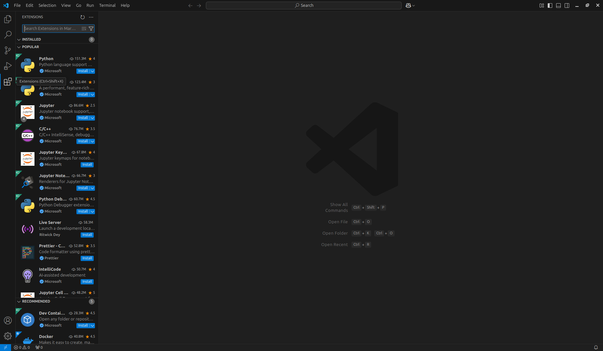

Then, search for the desired extension, click on the Install button, and wait for the installation
to complete.
:::

### Setup the Course Dev Container

::: danger
Failure to follow the instructions in this section **exactly** as presented may result in
permanently losing your work for this course! You have been warned!
:::

You will create **a single** dev container, which you will reuse for all projects in this course.
The structure of your dev container at the **end of this course** will look like:

- `/workspace/`: This is the directory of the dev container which is shared with your host machine.
  **Any data outside of this directory will not be saved when the container is stopped.**
  - `.devcontainer/`: This directory contains the configuration for the dev container itself. Do not
    modify this directory.
  - `scripts/`: This directory contains miscellaneous scripts for the course. A course staff member
    will provide instructions on how to use these utilities, if necessary.
  - `README.md`: This is the file you are currently reading. This file contains helpful reminders
    and instructions for using the dev container.
  - `SEMESTER-project-1-USERNAME/`: This is your personal project 1 repository, where `SEMESTER` is
    the current semester (e.g.: `sp25`) and `USERNAME` is your GitHub username (e.g.: `ghost`). It
    will be created for you when you accept the GitHub Classroom assignment for project 1
    (in Canvas).
  - `SEMESTER-project-2-USERNAME/`: Same as above, but for project 2.
  - `SEMESTER-project-3-USERNAME/`: Same as above, but for project 3.
  - `SEMESTER-project-4-USERNAME/`: Same as above, but for project 4.
  - `SEMESTER-project-5-USERNAME/`: Same as above, but for project 5.

To set up the course dev container, first download [this](https://github.com/csci-442-mines/student-env/releases/latest/download/student-env.zip)
file and extract it to a directory of your choice (Somewhere that is easy to access and safe from
accidental deletion). Then, open the top level of extracted directory in VS Code by any **one** of
the following methods:

1. (Recommended) Open VS Code and select `File > Open Folder...`: 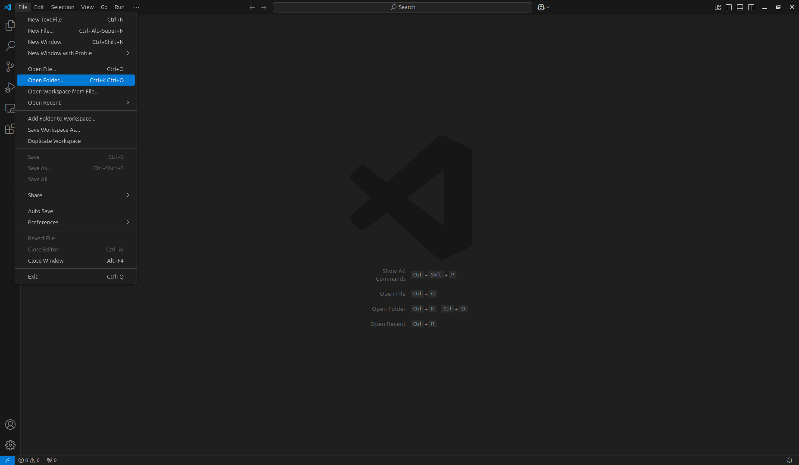
   Then, navigate to the directory where you extracted the course dev container. You should see VS
   Code switch to the directory you selected.
2. Right-click on the directory and select `Open with Code`. You should see VS Code open with the
   directory loaded in the window. Note that this option may not be available on all systems.
3. Run `code PATH_TO_DIRECTORY` in your system's terminal (Where `PATH_TO_DIRECTORY` is the actual
   path to the directory). You should see VS Code open with the directory loaded in the window.

Now that you have the directory open in VS Code, you should see a popup notification, typically on
the bottom right of the window, that says `Reopen in Container`:

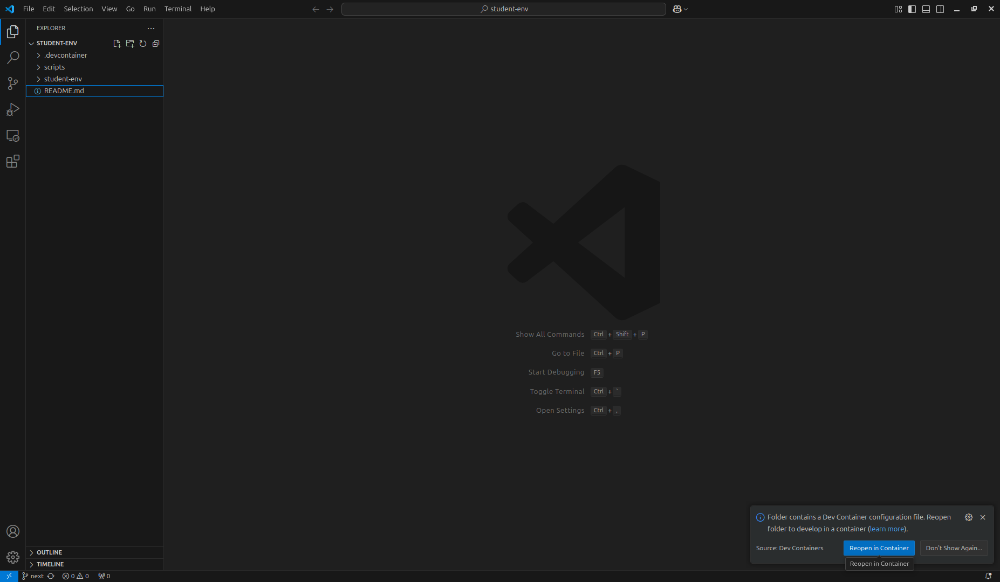

Click on `Reopen in Container` to build the dev container (which can take a few minutes). Once the
container is built, the loading bars will disappear. Open the **<u>integrated</u>** terminal (Not
the <u>system</u> terminal) by selecting `Terminal > New Terminal` from the top menu:

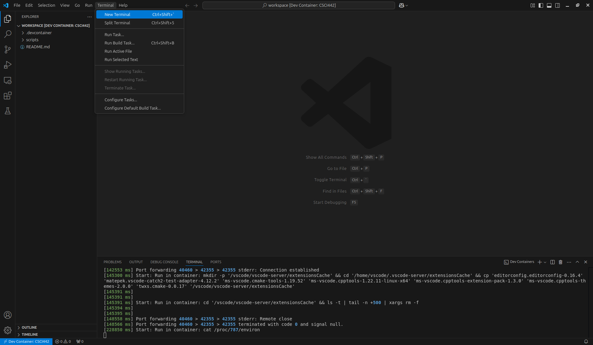

You should see a terminal window open at the bottom of the window:

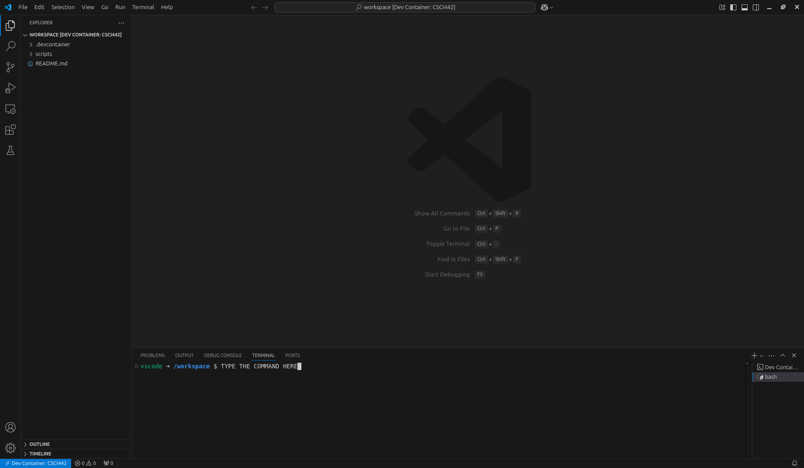

In the integrated terminal, run the following command to verify that the dev container is correctly
set up to save your work:

```shell
touch /workspace/hello-world.txt
```

If you navigate to the directory where you extracted the course dev container in your system's file
explorer/viewer, you should see a new file named `hello-world.txt`. If you do not see this file,
please double-check you've followed the instructions above and try again. If you still have issues,
please stop immediately and reach out to the course staff for help.

::: warning
Do not proceed past this point until you have verified that the dev container is correctly set up to
save your work!
:::

### Setup Git Inside the Dev Container

First, configure Git with your name and email address by running the following commands in the
integrated terminal:

```shell
git config --global user.name "YOUR_NAME"
git config --global user.email "YOUR_EMAIL"
```

Where `YOUR_NAME` is your GitHub username (e.g.: `ghost`) and `YOUR_EMAIL` is the email address
(e.g.: `ghost@example.com`).

Now, let's set up authentication with GitHub. You can use any **one** of the following methods:

1. (Recommended) Clone a private repository from GitHub for the first time **using HTTPS**. When you
   clone a private repository **using HTTPS** for the first time, you will be prompted to
   authenticate with GitHub:

   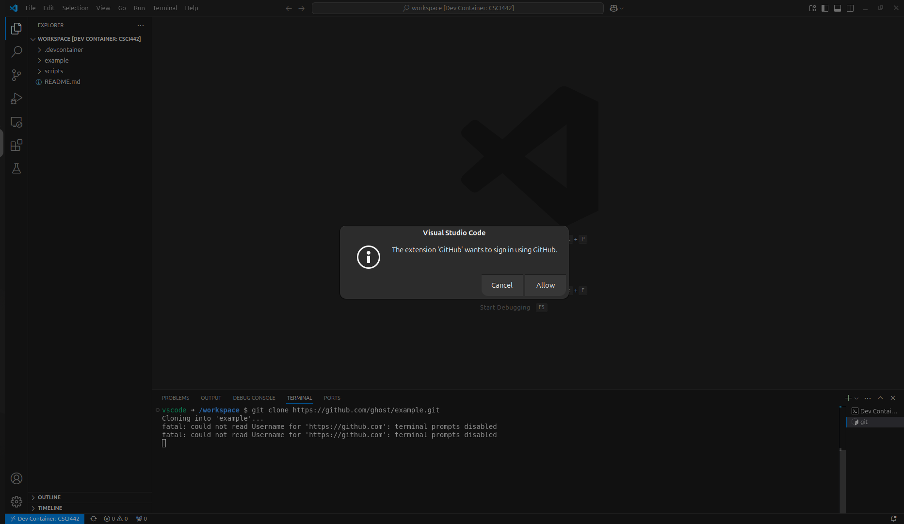

   Click `Allow`, and follow the prompts to sign in with your GitHub account. Note that if
   you do not use the HTTPS URL, you will get an error message when cloning the repository.

2. Manually setup SSH keys. You can follow the detailed instructions [here](https://docs.github.com/en/authentication/connecting-to-github-with-ssh/adding-a-new-ssh-key-to-your-github-account),
   but in short, generate new SSH keypair by running the below commands in the integrated terminal:

   ```shell
   ssh-keygen -a 100 -t ed25519 -N "" -f ~/.ssh/id_ed25519
   ```

   Then, get the public key with:

   ```shell
   cat ~/.ssh/id_ed25519.pub
   ```

   Finally, go to your [GitHub SSH keys settings](https://github.com/settings/keys), click
   `New SSH key` (**Not** `New GPG key`), give a descriptive title, set the key type to
   `Authentication key`, copy-paste the public key into the key field, and click `Add SSH key`.

### Per-Project Setup

::: warning
Failure to follow the instructions in this section **exactly** as presented may result in corrupting
your source code!
:::

For each project in this course, you will need to accept the GitHub Classroom assignment
(in Canvas). This will create a new private repository just for you under the `csci-442-mines`
GitHub organization based on the project template. Then, start the dev container by following
any **one** of the following methods:

1. (Recommended) Open VS Code, select `File > Open Recent`: 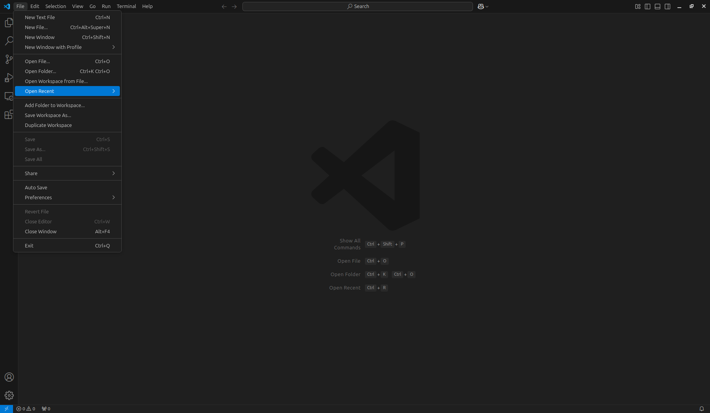 and
   then select the `PATH_TO_DIRECTORY/student-env [Dev Container]` (Where `PATH_TO_DIRECTORY` is the
   actual path to the directory). Note that you **must select the `[Dev Container]` entry**!
2. Open VS Code, select `File > Open Folder...`, navigate to the directory where you extracted the
   course dev container, and click on `Reopen in Container` popup (the same way you did for
   [setting up the course dev container](#setup-the-course-dev-container)).

Now that you've opened the dev container, open the top level of the workspace directory in the dev
container by selecting `File > Open Folder...`, navigate to the `/workspace/` directory, and click
`Ok`:


::: warning
If you skip this step (which must be done each time you set up a new project), you may end up
cloning repositories inside of each other, which will cause issues when committing and pushing
changes to GitHub.
:::

Once VS Code has opened/changed to the `/workspace/` directory, open the integrated terminal, and
run the following command to clone your project repository:

```shell
git clone PERSONAL_PROJECT_REPOSITORY_URL
```

Where `PERSONAL_PROJECT_REPOSITORY_URL` is the URL of your personal project repository (e.g.:
`https://github.com/csci-442-mines/sp25-project-1-ghost.git` if using HTTPS, or
`git@github.com:CSCI-442-Mines/sp25-project-1-ghost.git` if using SSH). You can find this URL by
going to the GitHub Classroom assignment page, opening your repository, and clicking on the green
`Code` button, and selecting the appropriate protocol.

Once the repository is cloned, open the project-specific `*.code-workspace` file (e.g.:
`project-1.code-workspace`) by clicking on it in the file explorer. You should see a popup
notification, typically on the bottom right of the window, that says `Open Workspace`:

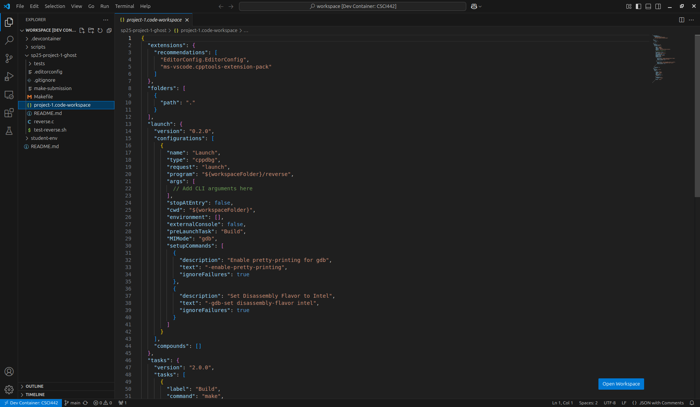

Click on `Open Workspace` to open the project-specific workspace (This will change VS Code's working
directory to the project directory and load the project-specific settings). Once the workspace is
open, you may get yet another notification asking if you would like to install the recommended
extensions for the workspace:

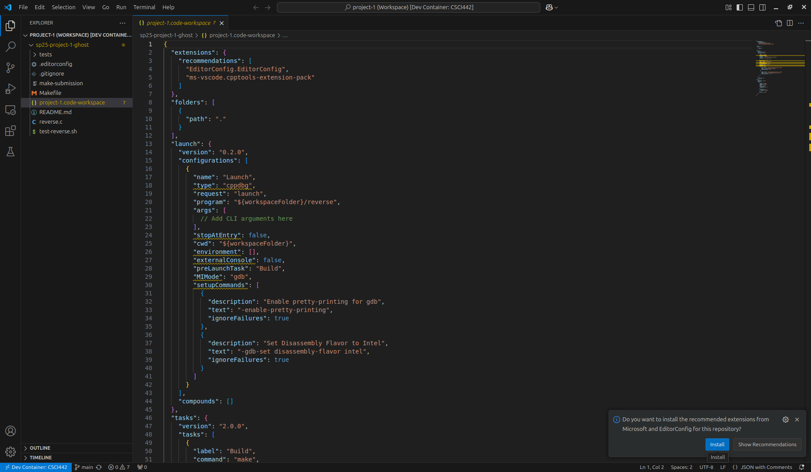

Click on `Install` to install the recommended extensions. Alternatively, you can install the
recommended workspace extensions by pressing `CTRL+SHIFT+P` (or `CMD+SHIFT+P` on Mac) to open the
command palette:

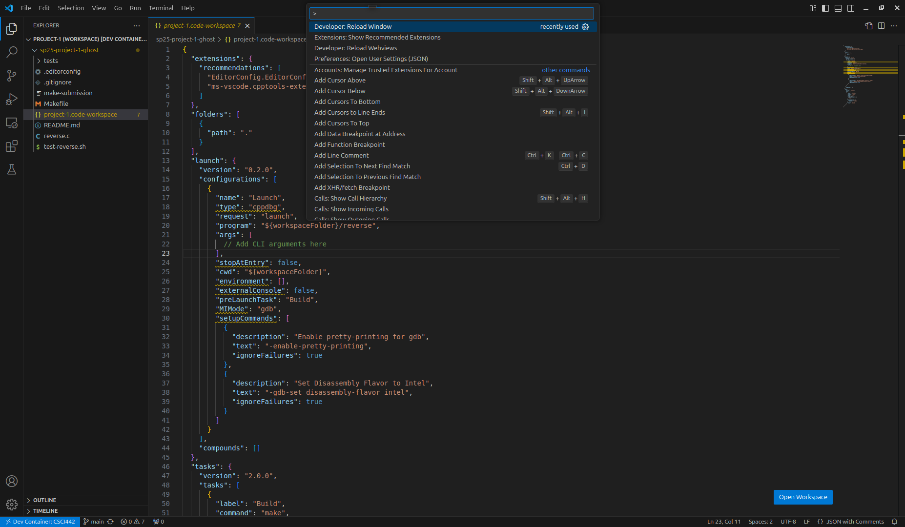

Then, type `Extensions: Show Recommended Extensions`, and press `Enter`. Then, click on the cloud
icon with a down arrow to install all recommended extensions:

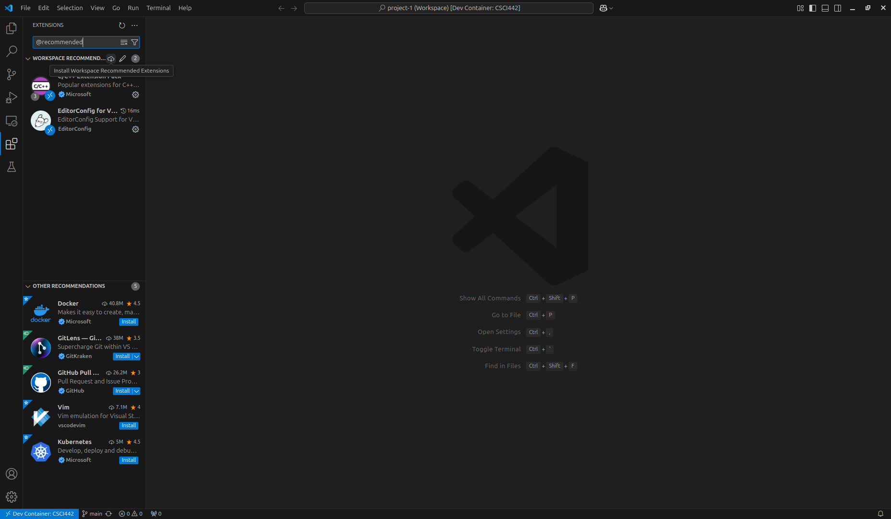

Once the extensions are installed, you can now start working on your project! Note that the
`*.code-workspace` file (e.g.: `project-1.code-workspace`) we provide is pre-configured with
everything you need for one-click building/debugging. You can find more information on how to use
the workspace file in the each project's `README.md` file.

## Common Issues

### VS Code Takes a Very Long Time to Build the Dev Container

- Symptom: building the dev container takes a very long time (e.g.: 20+ minutes).
- Solution: this can happen if you have a slow internet connection or computer. To workaround this,
  we provide a pre-built dev container image (`ghcr.io/csci-442-mines/student-env`). To use it, edit
  the `.devcontainer/devcontainer.json` like so:

  ```diff
  // Use the prebuilt image (Mutually exclusive with "build"!):
  - // "image": "ghcr.io/csci-442-mines/student-env:latest",
  + "image": "ghcr.io/csci-442-mines/student-env:latest",

  // Build the image yourself (Mutually exclusive with "image"!):
  - "build": {
  -   "dockerfile": "Dockerfile",
  -   "context": ".."
  - },
  + // "build": {
  + //   "dockerfile": "Dockerfile",
  + //   "context": ".."
  + // },
  ```

  _Note: the `+` and `-` symbols are non-literal and are used to indicate lines that should be added
  and removed, respectively. If you don't already have an `image` line, you can just add the `image`
  line like above and comment out the `build` section._

  Then, rebuild the dev container by clicking on the green `Reopen in Container` button in the
  bottom right corner of the window or by opening the command palette (`CTRL+SHIFT+P` or
  `CMD+SHIFT+P` on Mac) and typing `Dev Containers: Rebuild Container`.

### Cloning Using HTTPS Instead of SSH

- Symptom: you receive an error message when cloning a repository similar to:

```
fatal: could not read Username for 'https://github.com': terminal prompts disabled
remote: Repository not found.
```

- Solution: clone using the SSH URL (e.g.: `git@github.com:CSCI-442-Mines/sp25-project-1-ghost.git`)
  instead of the HTTPS URL (e.g.: `https://github.com/CSCI-442-Mines/sp25-project-1-ghost.git`).

### Cloning Using SSH Instead of HTTPS/SSH Key Not Set Up Correctly

- Symptom: you receive an error message when cloning a repository similar to:

```
git@github.com: Permission denied (publickey).
fatal: Could not read from remote repository.

Please make sure you have the correct access rights
and the repository exists.
```

- Solution: if you are intending on using HTTPS, use the HTTPS URL (e.g.:
  `https://github.com/CSCI-442-Mines/sp25-project-1-ghost.git`). If you are intending on using SSH,
  make sure you set up your SSH key correctly by following the instructions in the [Setup Git Inside
  the Dev Container](#setup-git-inside-the-dev-container) section.

### Can't Find The Project-Specific `*.code-workspace` File (e.g.:

`project-1.code-workspace`)

- Symptom: you can't find the project-specific `*.code-workspace` file (e.g.:
  `project-1.code-workspace`) in VS Code's file explorer.
- Solution: make sure you have opened the top level of the workspace directory in the dev container
  (See the [Per-Project Setup](#per-project-setup) section for more details).

### Missing Debug Configurations/Tools

- Symptom: the VS Code debug configurations and/or build/debug tools (e.g.: `clang`,
  `cmake`, `gcc`, `g++`, `make`, etc.) are missing.
- Solution: double check you have opened the course dev container **first**, and then opened the
  project-specific `*.code-workspace` file (e.g.: `project-1.code-workspace`) **second**. If you
  open the project-specific `*.code-workspace` file (e.g.: `project-1.code-workspace`) without
  first opening the course dev container (or in different dev container), the debug configurations
  and/or tools will be missing.
